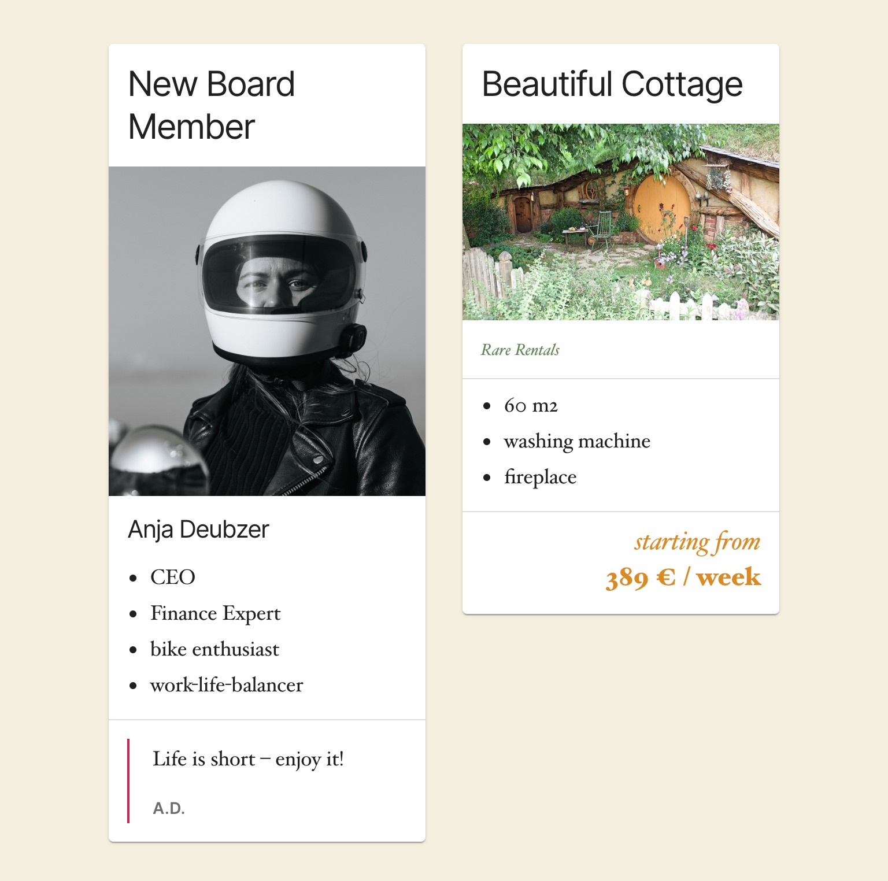

# Gutenberg Workshop
## Develop a Custom Gutenberg Block from Scratch
developed for Word Camp Prag - 29/02/2020

### Welcome to our Workshop. 

We want to instruct you to develop a custom gutenberg block from scratch with the help of tools the gutenberg team has developed.

The outcome of this workshop is a versatile Card Block you can hopefully adapt and reuse one one of your future projects.

This repository containes the finished card. 
To develop your own card - step-by-step - please go to the [wiki site](https://github.com/fabiankaegy/gutenberg-workshop-wordcamp-prague/wiki) of this repository.

Have fun!
[Fabian](https://twitter.com/fabiankaegy) & [Anja](https://twitter.com/anjadeubzer)

Examples of the card:


Use the cards for featuring your Content. Here you can see some examples. You can create templates which already contain prefilled inner Blocks.

To use the finished block run
```
`npm install`
```

After that you can use the block. For developing futher on the block run
```
`npm start`
```



